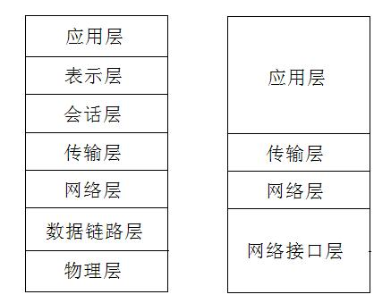

# tcp/ip 分层模型

TCP/IP协议模型分层

（1）网络接口层

　　TCP/IP协议模型的基层，负责数据帧的发送和接收。对应OSI模型中的物理层和数据链路层，是TCP/IP的最底层，不过通常在描述TCP/IP模型时还是会划分具体为物理层(PHY)和数据链路层(MAC)。

（2）网络层

　　通过互联协议将数据包封装成互联网数据包，并运行必要的路由算法。这里有4种互联协议。

　　(a)网际协议IP：负责在主机和网络之间的路径寻址和数据包路由。

　　(b)地址解析协议ARP：获得同一物理网络中的主机硬件地址。

　　(c)网际控制消息协议ICMP：发送消息，并报告有关数据包的传送错误。

　　(d)互联组管理协议IGMP：用来实现本地多路广播路由器报告。

（3）传输层

　　传输协议在主机之间提供通信会话。传输协议的选择根据数据传输方式而定。主要有以下2种传输协议：

　　(a)传输控制协议TCP：为应用程序提供可靠的通信连接，适用于要求得到响应的应用程序。

　　(b)用户数据包协议UDP：提供无连接通信，且不对传输包进行可靠性确认。

（4）应用层

　　应用程序通过这一层访问网络，主要包括常见的FTP、HTTP、DNS和TELNET协议。

# 